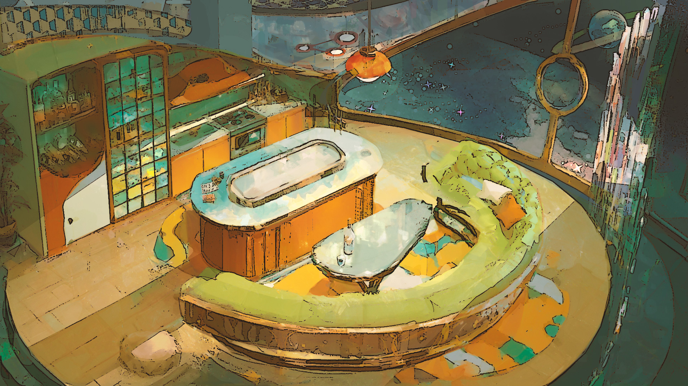

# Toy prototype that is a Balatro-like

<!-- TOC -->

- [Toy prototype that is a Balatro-like](#toy-prototype-that-is-a-balatro-like)
    - [Narrative](#narrative)
    - [Design: rough core game loop](#design-rough-core-game-loop)
    - [Art: direction](#art-direction)
    - [Engineering](#engineering)
    - [Licensing & Rights](#licensing--rights)

<!-- /TOC -->

Toy prototype that is a Balatro-like. With very similar systems, but adding some different flavor. Overalll would have a goofy scifi vibe.

Below is some summaries on various aspects of this project. For more documents, go to the Github Pages of this repo at https://eeriea.github.io/game-qs-grill/ .

## Narrative

The games name (temporary):

`Phineas' Quasi-Stellar Luxodo Emporium & Grill`

So it can be shortened to be `PhQSLEG`, which can be pronounced like "fix leg". But most in-game characters just call it "Phineas'", especially regulars.

The game world is a space opera stage, things happen in a fairly explored universe. Has several very active space races and political powers. The same as the trading game. See https://github.com/eerieA/game-nexarion .

## Design: rough core game loop

This is a galactic menu builder and life coach simulation. Mechanics are Balatro-like mixed with Strange Antiquities and Famicon Detective Club. There is a FP + Insight economy. Usually 2 main phases per level: card play, narrative puzzle.

- Card-based “cooking” gameplay (Balatro-style combo system), gives money and narrative clues (clue fragments)
- Short narrative puzzle phase (Ace Attorney and Golden Idol inspired, 3–4 decisions)
- Dual reward design: persistent cookware vs. temporary spice
- Light world consequence through ambient narrative flags

```
Card Play (Cooking Phase)
    ↓
Narrative Puzzle (Dialogue Phase)
    ↓
Reward & Consequence (Synthesis Phase, optional)
    ↓
Preparation (Next Customer / Chapter)
    ↓
Repeat
```

There may be an overarching main story connecting different characters' short stories. Not sure if for a first game that would be too ambitious.

## Art: direction

Currrently going for a toon-shading low poly direction. Here is a very rough concept art (not in 3D yet).



## Engineering

This project uses Godot. Common architecture systemic design principles and patterns are applied.

I am pretty sure whoever reads this markdown does not care about any engineering details.

## Licensing & Rights

- **Narrative content (story, lore, writing):**  
  Licensed under **Creative Commons Attribution 4.0 (CC BY 4.0)** unless otherwise noted.

- **Art assets (visuals, audio, UI, etc.):**  
  Intended to be released under **Creative Commons** licenses. Final license details will be specified once assets exist.

- **Game code and executable builds:**  
  All rights reserved. The source code and compiled game may not be redistributed, sold, or used to create derivative commercial products without explicit permission.

This repository contains early-stage work-in-progress material. Licensing terms may be refined as the project matures, but ownership of the finished game as a commercial product is reserved by the author.
