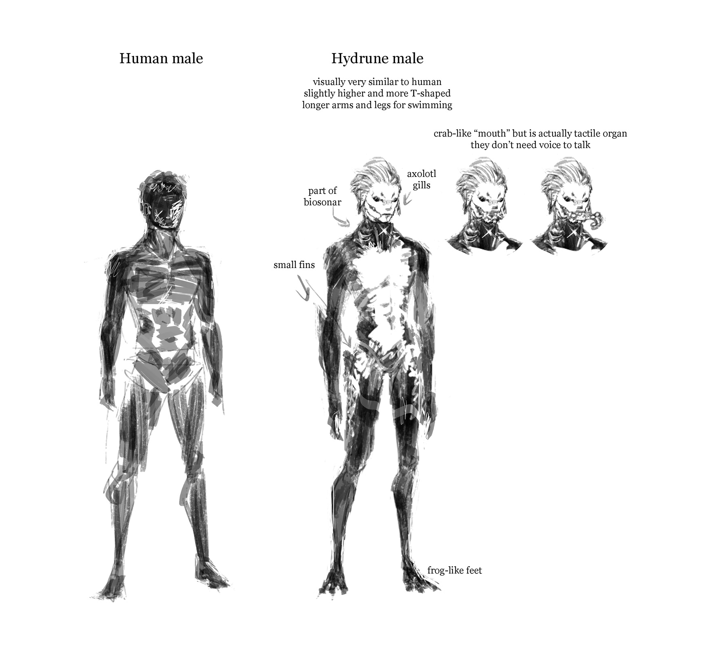

# Human

Is direct descendant of old earth human. They are very good at engineering like genetic engineering, so they can make themselve look like sibling species such as Hydrune, but that does not last long since environment adaptability is a complex, multi-system change costing a lot.

# Hydrune

The aquatic human variant that diverged from old earch human since they chose to settle on sea-rich planets after The Collapse.

