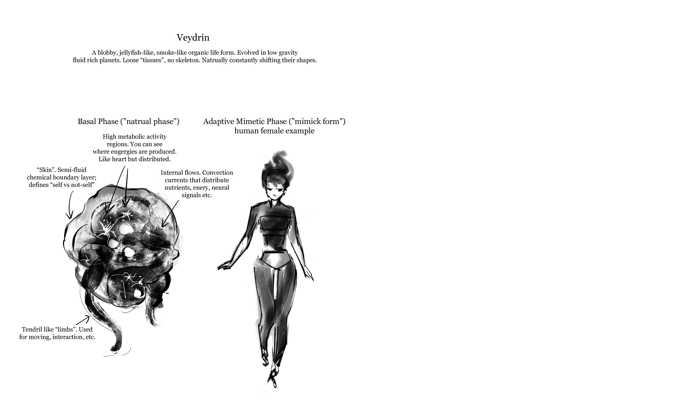

# Human

Was direct descendant of old earth human. Look into the narrative document for details.

# Hydrune

Was also direct descendant of old earth human. But this aquatic human variant diverged enough from neo humans to become a separate species. Look into the narrative document for details.

# Veydrin

The "jellyfish" or "cloudlet" people. Constantly shape shifting by nature, but can temporily stablize to mimic appearances of other species. Look into the narrative document for details.

