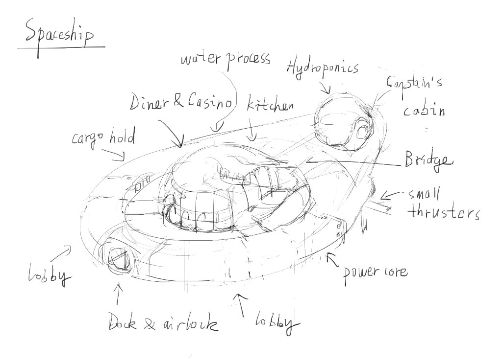
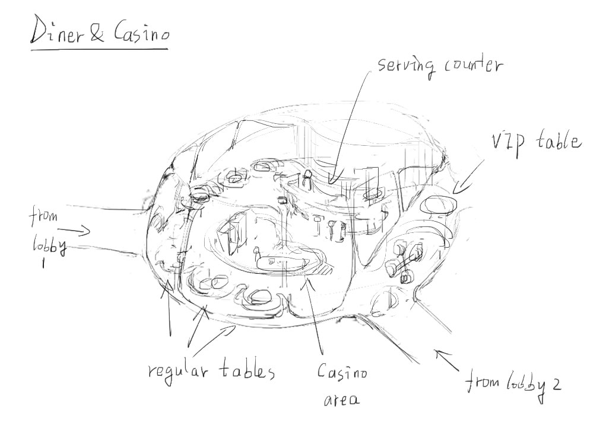
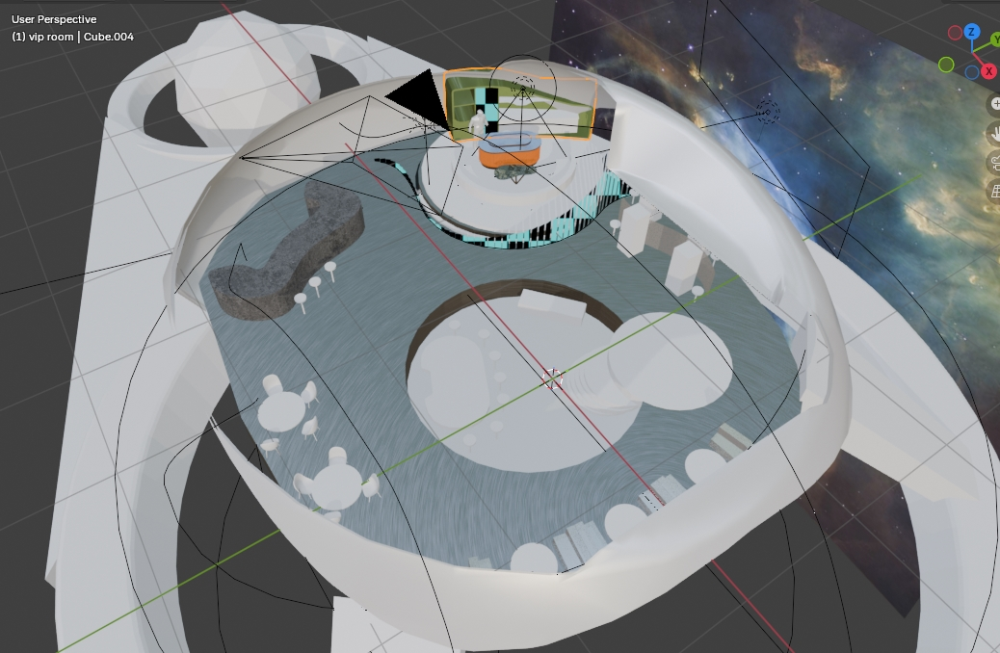

There will be only one spaceship, that of Phineas', where the emporium also lives.

Has functional areas like

- Bridge
- Captain’s cabin
- Diner & casino
- Kitchen
- Hydroponics bay
- Engine room
- Cargo hold
- Bathroom
- Airlock
.

## Diner and casino

This is the hearth of the ship. Almost all of in-game environments come from this room of the spaceship.

## VIP room

This is not the hearth of the ship, but will be one of the two main stages where all things in this game happen. It is a room reservable by special customers, located at a corner of the ship for more privacy. Phineas only takes one such customer per cycle... more or less.

